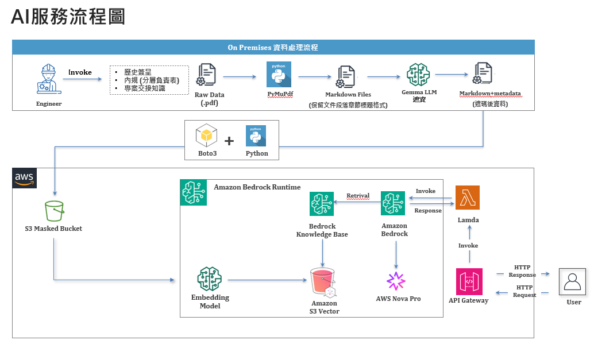

# AWS Bedrock實作內部公文生成，含AWS CLI環境設定教學與lambda部署

這個範例展示如何在 VS Code 內使用 Python 透過 AWS Bedrock 進行下列動作：

- 測試指定的 Knowledge Base 是否可用
- 依照 metadata 進行向量檢索
- 將檢索結果傳遞給指定的 Bedrock 文字模型（例如 Claude 3 Sonnet）完成推論



## 目錄結構

```
.
├── README.md                # 說明與使用教學
├── requirements.txt         # 執行 CLI 所需套件
├── setup.py                 # 套件安裝與 kb-cli entry point
├── cli.py                   # 命令列工具，對應 rephrase / ret-gen / retrieve
├── lambda_handler.py        # 部署至 Lambda 的進入點
├── test.py                  # 本地測試三個主要情境的腳本
├── test_lambda.py           # Lambda 事件模擬測試
├── tools/                   # 共用模組
│   ├── __init__.py
│   ├── config.py            # 基礎設定（model、retrieve、retrieve&generate）
│   ├── rephrase.py          # 單純重述問題
│   ├── retrieve.py          # 產生 metadata filter 並呼叫 retrieve API
│   └── retrieve_generate.py # 呼叫 retrieve_and_generate API
└── output/                  # ret-gen 指令或測試輸出的內容
```

## 先決條件

1. 已具備對應 AWS 帳號的 IAM 權限，可呼叫 `bedrock-agent-runtime` 與 `bedrock-runtime` API。
2. 工作站已設定好 AWS 認證資訊（`~/.aws/credentials` 或 `AWS_ACCESS_KEY_ID` 等環境變數）。
3. 在vscode terminal,運用sh指令執行aws_local_access.sh,可以輸入MFA_CODE_ON_PHONE, 之後把echo出的那三組密碼丟入settings.json
4. aws s3 ls測試有沒有權限操作aws, 若無法，請重開一個vscode terminal
4. 目標 Knowledge Base、向量儲存區與 Bedrock 模型均已在對應 Region 建立。

## 安裝

此專案建議使用 Conda 建立隔離環境並指定 Python 版本，例如 3.11：

```bash
conda create -n aws python=3.11 -y
conda activate aws
pip install --upgrade pip
pip install -r requirements.txt
pip install -e .
```

`requirements.txt` 會安裝執行 CLI 所需的第三方套件，`setup.py` 則會註冊 `kb-cli` 這個命令列工具，方便於任何資料夾直接執行。

## 必要環境變數

| 變數 | 用途 |
| ---- | ---- |
| `AWS_REGION` 或 `AWS_DEFAULT_REGION` | 目標 Region（未設定時預設 `us-east-1`） |
| `KNOWLEDGE_BASE_ID` | `ret-gen` 與 `retrieve` 指令預設使用的 Knowledge Base ID |
| `MODEL_ARN` | `ret-gen` 指令預設使用的 Bedrock 模型 ARN |

## 使用方式

CLI 以三個子指令對應 `test.py` 中的情境，讓常見測試可以直接透過終端機執行。

### 1. 重述問題（rephrase）

```bash
kb-cli rephrase "幫我生成SAS軟體採購簽呈"
```

輸出 JSON，包含原始輸入與模型改寫後的敘述，可快速驗證重述 Agent 是否正常。

### 2. Retrieve & Generate（ret-gen）

```bash
kb-cli ret-gen "幫我生成2025 SAS Viya雲端簽呈。" --kb-id JJYFVHJSPA --model-arn arn:aws:bedrock:us-east-1::foundation-model/amazon.nova-pro-v1:0 --save-output
```

- `--kb-id` 與 `--model-arn` 可省略，若已在環境變數設定 `KNOWLEDGE_BASE_ID`、`MODEL_ARN`。
- `--save-output` 可選，每次執行會將生成的文字寫入 `output/ret_and_gen.md`（或自訂路徑）。
- `--top-k` 讓你調整檢索回傳段落數。

指令會將 `retrieve_and_generate()` 的完整 JSON 回傳到終端機，同時另外輸出純文字結果，方便串接後續流程。

### 3. 只檢索 chunk 或檢視 metadata filter（retrieve）

```bash
# 同時取得 chunk 與 metadata filter
kb-cli retrieve "幫我生成SAS Viya雲端簽呈" --kb-id JJYFVHJSPA

# 若只想檢視 metadata filter
kb-cli retrieve "幫我生成SAS Viya雲端簽呈" --kb-id JJYFVHJSPA --metadata-only
```

- 預設輸出包含 `chunks`（`retrievalResults`）以及模型產生的 `metadata_filter`。
- `--metadata-only` 可以跳過 `retrieve()`，單純觀察 filter 結果。
- `--show-raw` 會額外附上 `bedrock-agent-runtime.retrieve` 的原始回應，方便除錯。
- `--top-k` 同樣可以調整 `retrieve` 的 `numberOfResults`。

## 開發與除錯

- 指令列工具會以 `json.dumps(..., ensure_ascii=False)` 輸出結果，VS Code 終端機可以直接閱讀中文。
- 若要檢視實際送出的 metadata filter 格式，可使用 `print` 或在 `kb_tool/config.py` 中加入額外 logging。
- 一旦需要進行更進階的 filter（例如 `in`、`greaterThan`），可在 `metadata_dict_from_key_values` 內擴充。

## Lambda 部署

我已經為您創建了三個檔案：

### 1. lambda_handler.py - Lambda 主程式
- 接收 prompt_question 輸入
- 使用 RetrieveGenerateConfig 設定
- 呼叫 retrieve_generate.py 執行檢索與生成
- 回傳簽呈草稿文字

### 2. test_lambda.py - 測試案例
包含三種測試情境：
- 直接事件格式
- API Gateway 格式（JSON body）
- 錯誤情況處理

### 3. requirements_lambda.txt - Lambda 依賴

### 部署前準備

設定環境變數（在 test_lambda.py 中更新實際值）：
```bash
KNOWLEDGE_BASE_ID=your-actual-kb-id
MODEL_ARN=your-actual-model-arn
```

本地測試：
```bash
python test_lambda.py
```

Lambda 部署時需要：
- 將整個 tools/ 資料夾一起打包
- 設定環境變數 KNOWLEDGE_BASE_ID 和 MODEL_ARN
- 確保 Lambda 執行角色有 bedrock-agent-runtime 權限

Lambda 函數會回傳 JSON 格式，包含 draft_text 欄位存放生成的簽呈草稿。